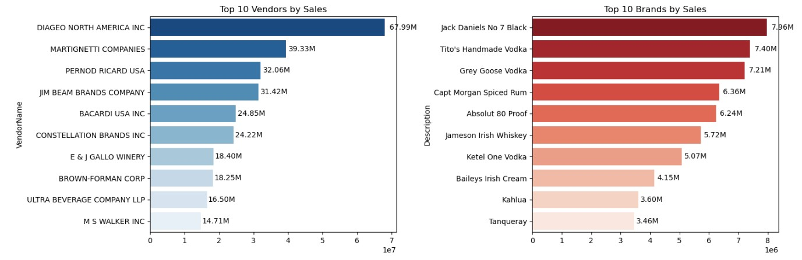
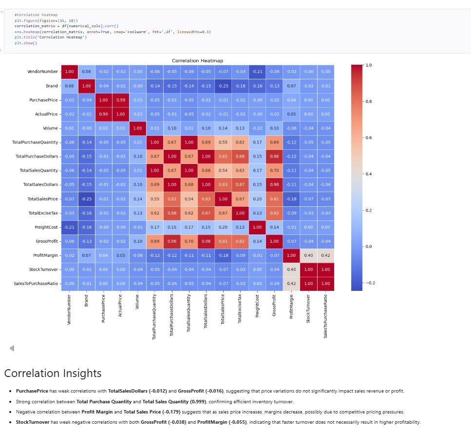
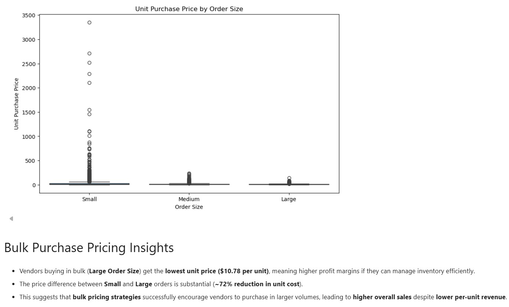
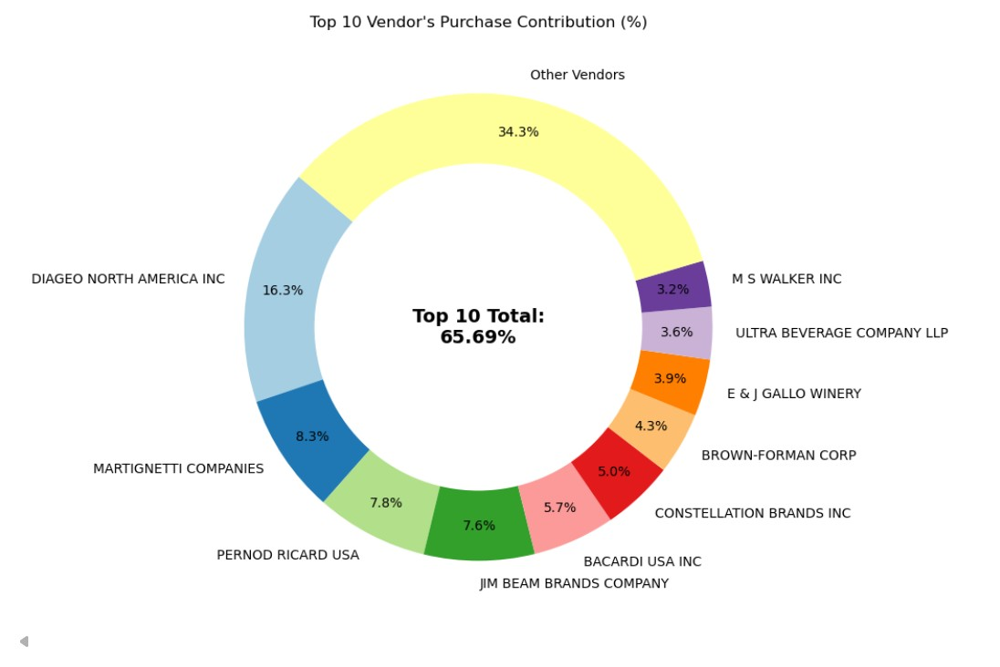
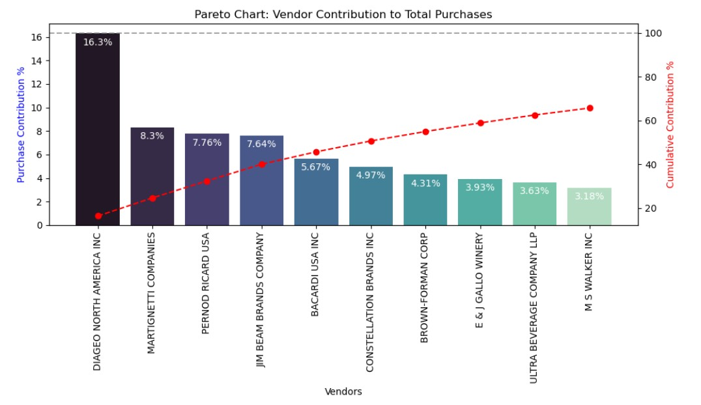
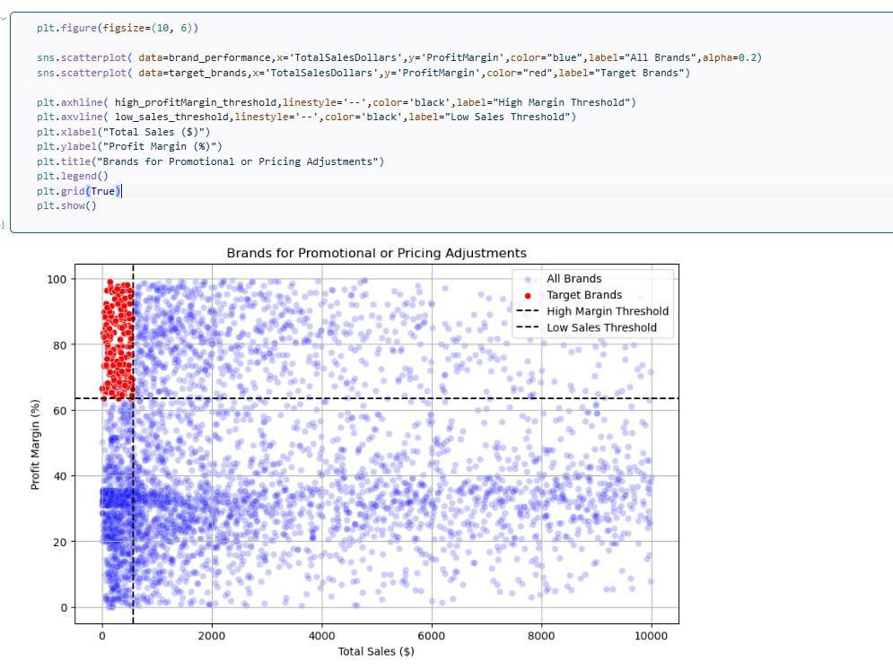
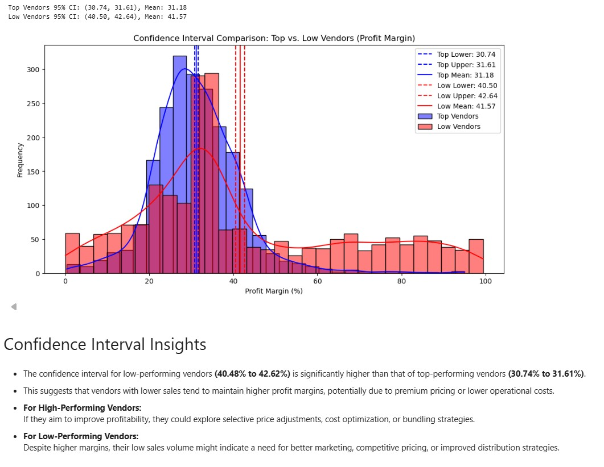

# 📊 Vendor Performance Data Analytics Pipeline

## Overview

This project builds an end-to-end data analytics workflow for processing and analyzing large vendor datasets. Raw Excel/CSV files are ingested into a database, cleaned, transformed, merged using SQL operations, and analyzed to generate meaningful business insights.

The project focuses on implementing practical ETL concepts, data processing techniques, and analytical workflows on real-world datasets.

---

## Project Objectives

* Build a scalable data ingestion pipeline
* Process large datasets efficiently using batch loading
* Store and manage data in a database
* Clean and transform raw data
* Merge multiple tables for targeted analysis
* Create calculated business metrics
* Perform exploratory data analysis
* Generate visual insights
* Produce a professional analytical report

---

## Tech Stack

| Technology       | Purpose                       |
| ---------------- | ----------------------------- |
| Python           | Data processing               |
| Pandas           | Data manipulation             |
| SQL              | Data querying                 |
| SQLite           | Database storage              |
| SQLAlchemy       | Database connection           |
| Jupyter Notebook | Analysis                      |
| Logging          | Monitoring pipeline execution |

---

## Project Workflow

```text
Raw Excel/CSV Files
        ↓
Batch Data Ingestion Pipeline
        ↓
SQLite Database Storage
        ↓
Data Cleaning & Transformation
        ↓
SQL Querying + Table Merging
        ↓
Feature Engineering
        ↓
Exploratory Data Analysis
        ↓
Insights & Reporting
```

---

## Key Metrics Created

* Gross Profit
* Profit Margin
* Stock Turnover
* Sales-to-Purchase Ratio

---

## Features Implemented

✔ Batch loading for handling large datasets efficiently

✔ Database ingestion using SQLite + SQLAlchemy

✔ Logging for monitoring and debugging

✔ Data cleaning and preprocessing

✔ SQL-based table merging

✔ Feature engineering

✔ Advanced visual analysis

✔ PDF report generation

---

## Screenshots

### Top Vendors and Brands



---

### Correlation Heatmap



---

### Bulk Purchasing Insights



---

### Top Vendors Purchase contribution



---

### Vendor Contribution to total Purchases



---

### Brands for Promotion and Sales



---

### Confidence Interval Analysis




## Key Findings

* Identified top-performing vendors
* Analyzed profitability across products
* Detected products with negative profit contribution
* Identified inventory movement patterns
* Evaluated vendor performance using business metrics

---

## Future Improvements

* Add workflow scheduling using Airflow
* Integrate PostgreSQL instead of SQLite
* Create interactive dashboards
* Deploy analytics workflow in the cloud

---

## Installation

Clone repository:

```bash
git clone https://github.com/s-a-n-d-ip/Vendor-Performance-Data-Analytics.git
```

Install dependencies:

```bash
pip install -r requirements.txt
```

Run ingestion pipeline:

```bash
python ingestion_db.py
```

Run analysis:

```bash
jupyter notebook
```

---

## Project Structure

```text
Vendor-Performance-Data-Analytics/
│
├── data/
├── SQL_QUERY/
├── logs/
├── notebooks/
├── screenshots/
├── reports/
├── ingestion_db.py
├── get_vendor_summary.py
├── logger_setup.py
├── requirements.txt
├── .gitignore
└── README.md
```

---

## Author

Sandip Ghosh

GitHub:
https://github.com/s-a-n-d-ip
